<link rel="stylesheet" href="style.css">

# Instalación de Arch Linux

Arch Linux es una distro basada en GNU/Linux, esta distro es conocida gracias a su alto rendimiento y a su “dificultad” de instalación ya que en el arranque te planta en una terminal para que a través de comandos se instalen todos los componentes necesarios del sistema. Esto es lo que hace a Arch una de las mejores distros de Linux, el hecho de que sea un SO que no trae software innecesario que afecten al rendimiento del ordenador. 

<aside>
💡 Para instalar Arch se recomienda leer y estar bien informado para no pasar por baches, puede ver su <a href="https://wiki.archlinux.org/title/Installation_guide_(Espa%C3%B1ol)">guía oficial de instalación en español</a>.
</aside>

## 🪛 Pre-instalación

Antes de la instalación debemos contar con lo siguientes supuestos:

1. Un emulador de máquinas virtuales (VirtualBox en este caso).
2. La imagen ISO del sistema operativo a instalar (Arch Linux).
3. Otra cosa importante es validar los requisitos de Hardware del SO, Aunque por lo generar las distros Linux no suele requerir una cantidad excesiva de recursos.
<aside>

✅ Para una buena experiencia recomiendo lo siguiente:

- Arquitectura x86-64.
- De 3.5 GB a 4 GB de RAM.
- De 20 GB a 30 GB de espacio en disco.
- De 2 a 4 procesadores.
- Conexión a internet.
</aside>

### Creación de la máquina virtual

Lo primero es iniciar nuestro virtualizador de máquinas virtuales, en este caso Oracle VM VirtualBox.

Una vez dentro se debe crear una nueva máquina virtual, para eso en la barra de herramientas de VirtualBox clic en `Máquina` y seguidamente en `Nueva`**.**

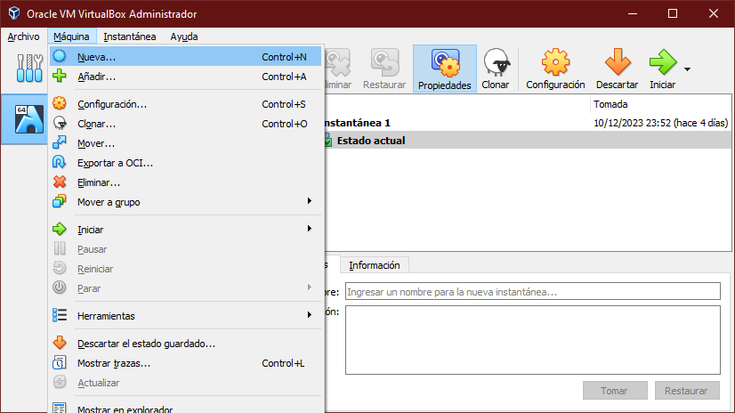

Posteriormente se mostrará una ventana con los siguientes campos:

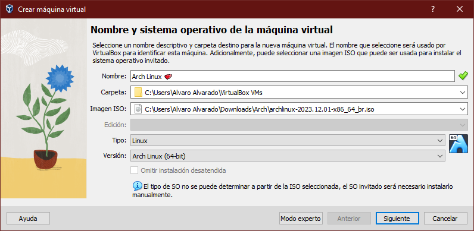

- **Nombre:** El nombre la máquina virtual, en este caso “Arch Linux”.

- **Carpeta:** Es este apartado se selecciona la carpeta donde se guardará la máquina virtual, se recomienda dejarlo por defecto.

- **Imagen ISO:** Acá se debe elegir la imagen del sistema operativo en formato ISO, *VirtualBox permite navegar en los directorios para encontrar el archivo de forma intuitiva aunque también permite ingresar la ruta escribiéndola*.

- **Tipo y Versión:** Aquí se escoge el tipo de SO del ISO (Windows, Mac, Linux, etc..) y la versión del mismo.

Cuando estos campos ya estén listos hacer clic en `siguiente` para proseguir con la instalación.

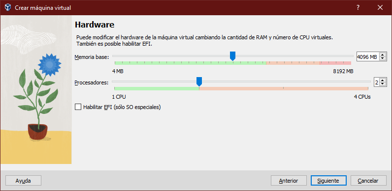

En esta parte debe asignarle una cantidad definida de memoria RAM a la máquina virtual, en mi caso le asignaré 4096 MB (es el equivalente de multiplicar 1024 MB/GB por 4 GB) de RAM y 2 procesadores, en mi caso no habilitaré EFI.

<aside>
🚧 No se recomienda asignar más de la mitad de la RAM  y de los procesadores del ordenador porque podría provocar un desbordamiento de pila.
</aside>

Clic en `siguiente`.

Ahora VirtualBox pedirá que le asignemos un disco duro a la máquina virtual, Brinda tres opciones:

- **Crear un disco virtual ahora:** Creará un archivo VDI (VirtualBox Disk Image) que funcionará como un disco duro, permite que este ocupe un tamaño máximo definido (30 GB en mi caso) y que el espacio que ocupe sea dinámico (que cambie según se requiera).

- **Usar un archivo de disco duro virtual existente:** Permite seleccionar algún otro disco virtual creado previamente.

- **No añadir disco:** Ocupa el disco duro real.

Por último mostrará un resumen con los datos del hardware (virtual) asignado a la máquina virtual.

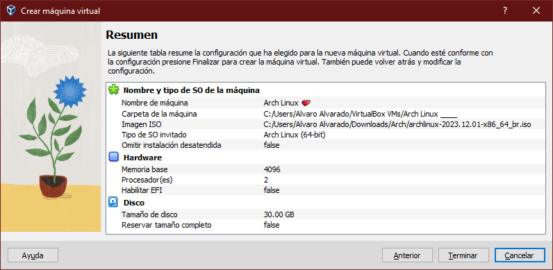

Clic en `Terminar` para finalizar la creación de la máquina virtual.

Si todo salió bien la nueva máquina virtual debería aparecer en la lista de máquinas virtuales al costado izquierdo de la GUI Oracle VM VirtualBox, justo como se muestra en la imagen.

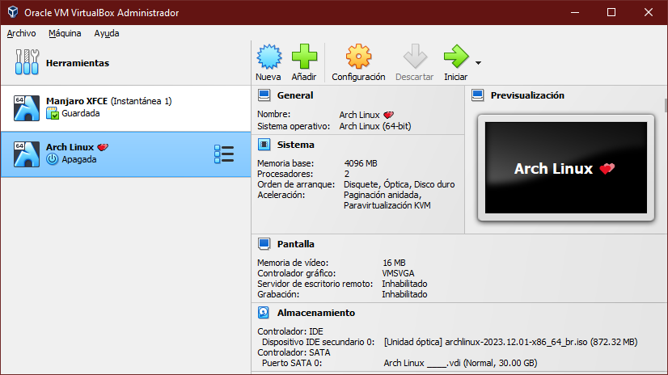

## ⬇️ Instalación

Como se mencionó anteriormente, Arch Linux suele tener una instalación “compleja” en comparación a otras distros que se orientan a usuarios nuevos con Linux. Sin embargo, hoy en día existe una script denominado `archinstall` que automatiza un poco este proceso, este script es el que se usará.

<aside>
💡 Para una personalización completa de Arch Linux se recomienda una instalación manual, puede consultar la <a href="https://wiki.archlinux.org/title/Installation_guide_(Espa%C3%B1ol)">guía de instalación de Arch en español</a>.  Para mayor información de archinstall ver la  <a href="https://wiki.archlinux.org/title/Archinstall_(Espa%C3%B1ol)">documentación oficial de archinstall en español</a>.
</aside>

Para iniciar con la instalación de Arch Linux se debe  iniciar la máquina virtual previamente creada, para esto debe hacer clic en el botón `Iniciar` dentro del panel de detalles de la VM (Virtual Machine).

Una vez que arranque la VM aparecerá la GRUB (GRand Unified Bootloader) de Arch Linux con muchas opciones.

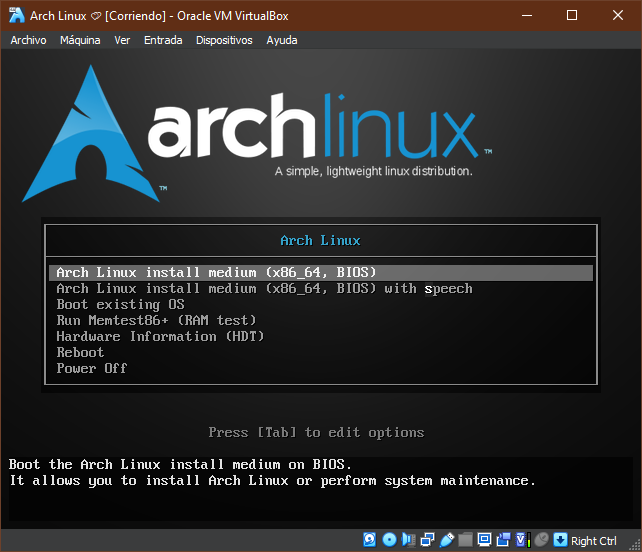

Acá se debe seleccionar la primer opción `Arch Linux install medium (x86_64, BIOS)`. Luego de cargar nos plantará en un terminal como se muestra a continuación.

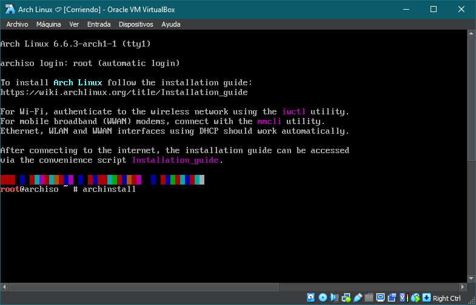

En esta parte es donde ejecutamos comandos para instalar dicho SO, en este caso ejecutamos el script que proporciona una instalación guida escribiendo `archinstall` y presionando `Enter`.

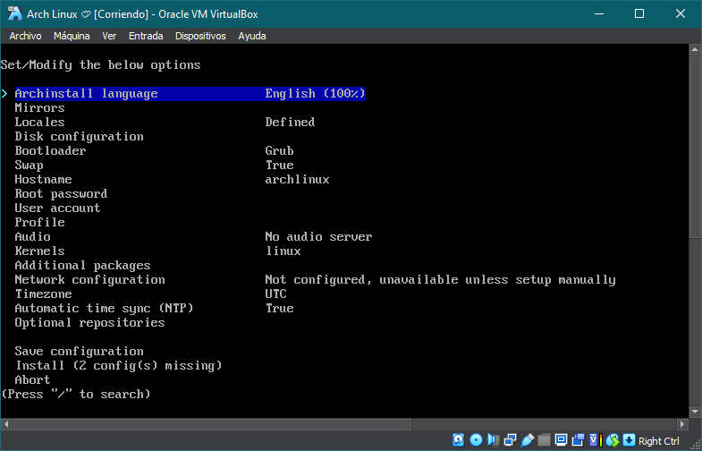

El script ejecutado proporcionará una serie de opciones que son impresindibles en toda la instalación de Arch. Por defecto el idioma estará en ingles pero se puede cambiar configurandolo desde la primer opción.

<aside>
💡 Para moverse entre las opciones del menú use ⬆️ y ⬇️ (flechas del teclado), para seleccionar una opción presione enter.
</aside>

### Cambiando el idioma de Archinstall

Archinstall permite cambiar su idioma, aunque siempre está disponible en todos lo idiomas si cuenta con los más comúnes.

Para seleccionar un idioma debe entrar en la opción y escojer un idioma (español en mi caso) de los que muestre Archinstall. Luego se seleccionarlo Archinstall debería estar traducido.

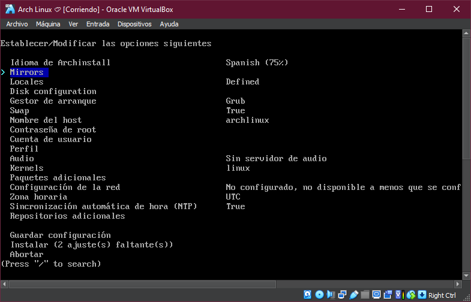

### Selección del espejo

En esta opción se define la región del servidor que se usará para descargar todo lo necesario del SO.

<aside>
🚧 Si no hay espejos cerca de su país es recomendable que eliga el espejo global (worldwide).
</aside>

### Locales

Aqui se configura todo lo referente al teclado y la zona regional. Este apartado se divide en tres partes, recomiendo las siguientes configuraciones:

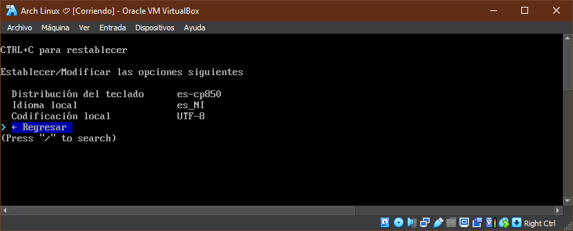

### Configuración del disco

Aquí se configuran las particiones del disco en que se instalara Arch Linux. Al entrar saldran tres opciones

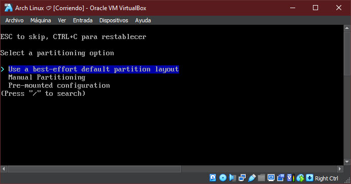

Damos `Enter` en la primera para no configurar las particiones manualmente.

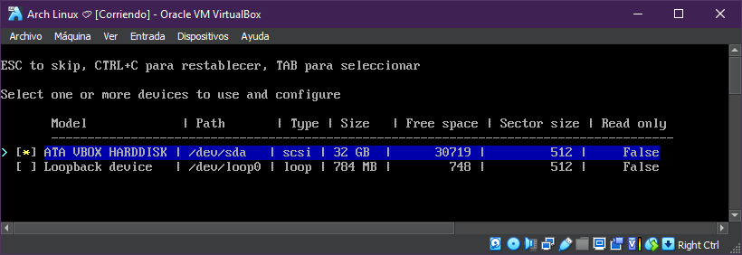

En esta parte seleccionamos el disco virtual que creamos al momenot de crear la máquina virtual, nos guiamos por su tamaño en GB *(en este caso 30 GB aproximadamente*).

Posteriormente se selecciona el sistema de archivos en que se basara el disco (ext4 es el más popular entre las distros de linux).

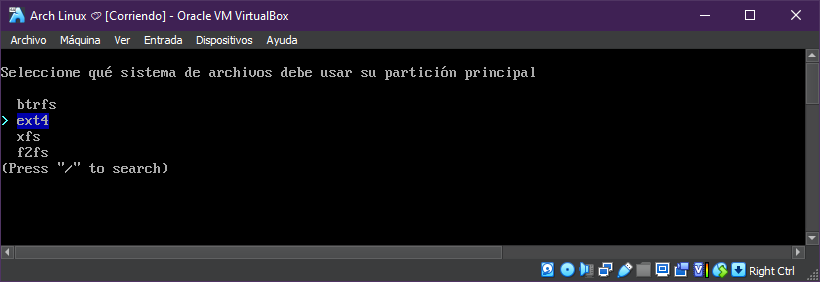

### Desabilitando swap

Hasta el momento no requerimos de una partición swap que funcione como memoria d eintercambio por lo que la desactivaremos.

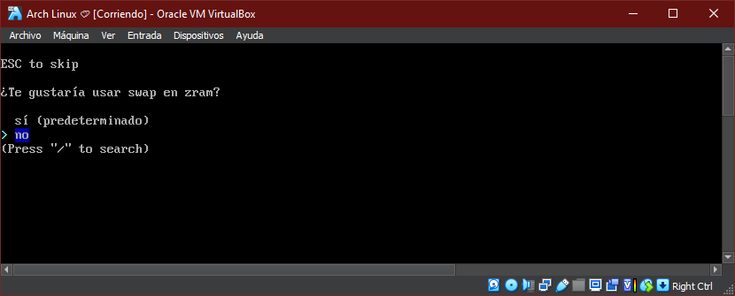

<aside>
⚠️ Hay rumores que dicen que el no desabilitar swap puede roper las particiones del SO.
</aside>

### Cuenta de usuario

Acá se creará la cuenta de usuario del orenador, aparecen tres opciones.

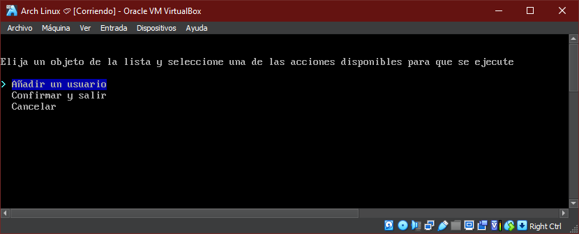

Enter en `añadir un nuevo usuario`. Luego pedirá ingresar el nombre de usuario, su contraseña y preguntará si el usuario debe ser superusario (decimos que si). 

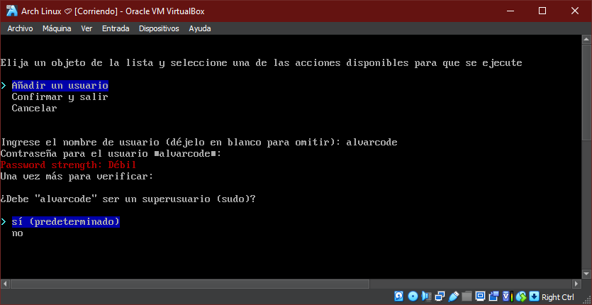

Al final nos deben salir todos los usuarios creados en la siguiente tabla.

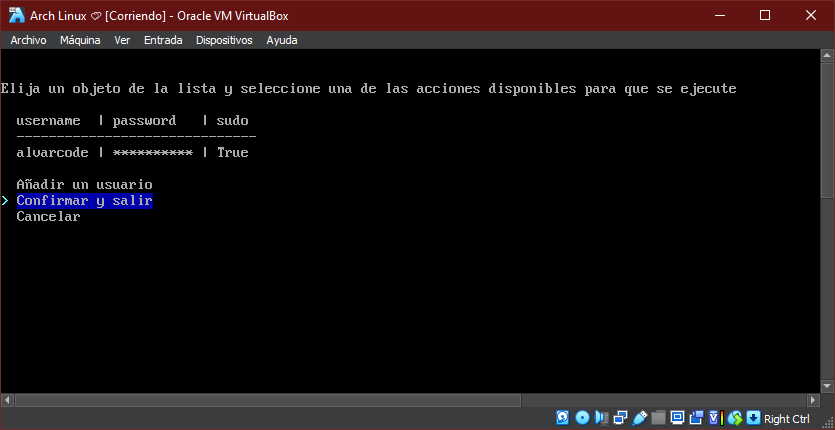

Enter en `confirmar y salir`.

### Selección de Perfil

En este aprtado se tiene que escoger el modo de uso del SO y su configuración. Entrar en `Perfil > Type`. Saldrán las siguientes opciones:

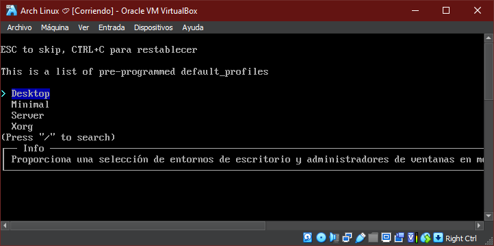

Seleccionamos `Desktop` y pasamos a elegir el entorno de escritorio de preferencia.

<aside>
🧠 Un entorno de escritorio no es más que la forma en la que se dibujan las ventanas de las aplicaciones de un sistema operativo.
</aside>

Existen muchos entornos de escritorio pero los más populares son: GNOME, Cinnamon, KDE Plasma, XFCE, LXQT, i3 y BSPWN.

*Recomiendo GNOME, Cinnamon y Plasma para ordenadores desentes y XFCE para ordenadores de bajos recursos.*

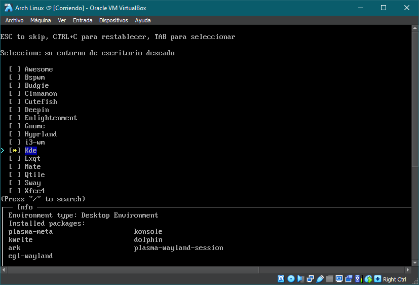

Despues de seleccionar un entorno de escritorio damos enter en `Regresar`.

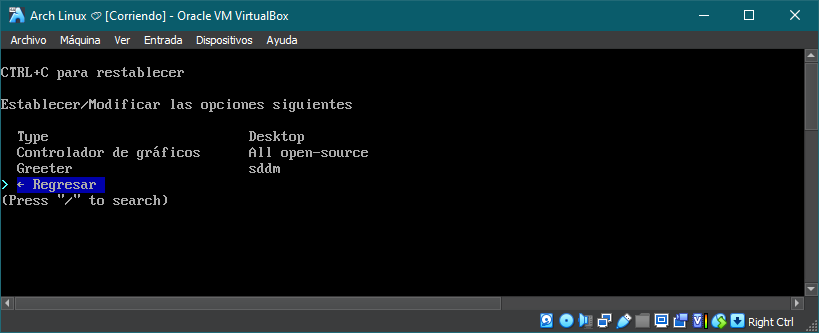

### Paquetes adicionales

Esta opción permite ingresar paquetes de software para que se instalen junto con el sistema, en mi caso agregaré el navegador web **Firefox**.

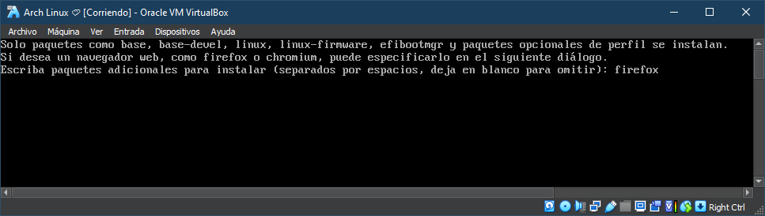

### Zona horaria

Muestra muchas opciones de regiones horarias, en mi caso `América/Managua`.

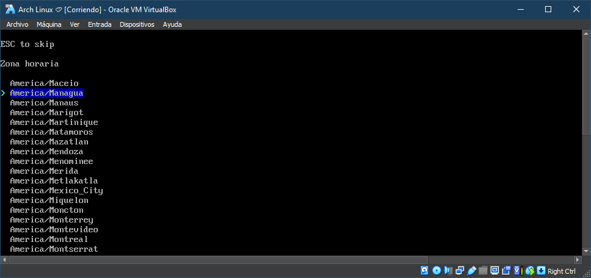

<aside>
En esta guía de instalación se abordaron las opciones necesarias para la instalación de básica de Arch Linux, algunas de las otras opciones son "innecesarias" o ya están definidas. 
</aside>

### Configuración final

La configuración final debería quedar así:

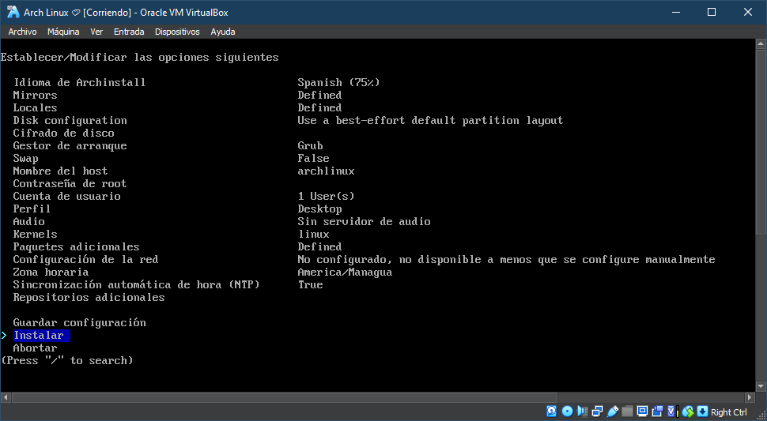

Damos enter en `Instalar` para comenzar con la instalación de Arch Linux.

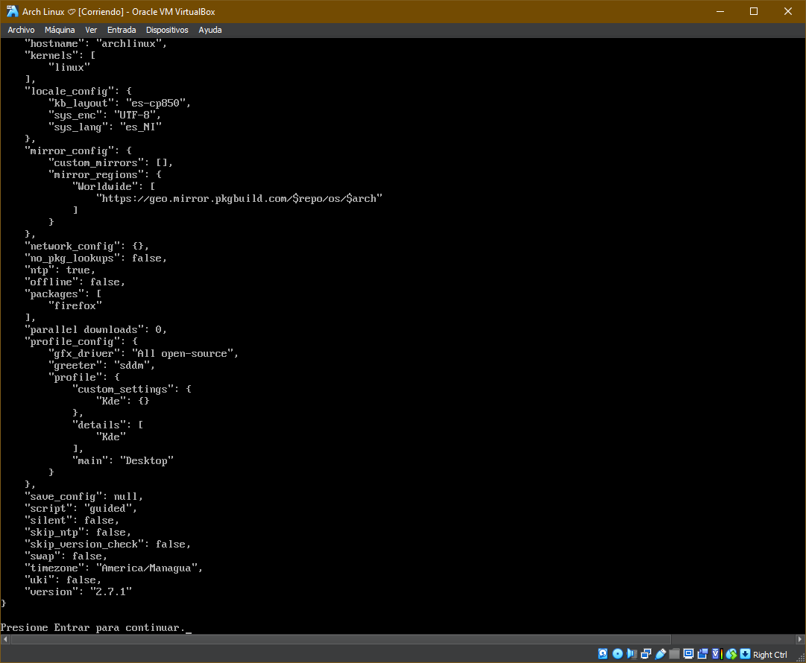

Damos Enter otra vez y esperamos a que el SO se instale por completo...

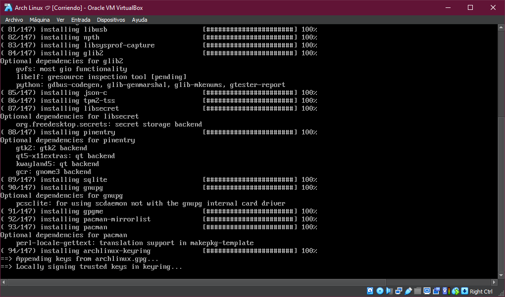
